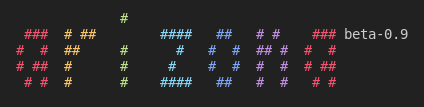

Arizona is a free software streaming client for Icecast servers
written in C programming language using the libshout library.
She supports playing ordered songs using the "queue" table
in a MySQL database and common functions like playlist sorting
and playlist repeating.

#### Knowledge base

If you wanna know how to compile, install or configure Arizona please
make sure to check out our [Wiki pages](https://github.com/tlpr/arizona/wiki).

#### Licenses and credits

Arizona is free software licensed under the [GNU General Public License 3.0](https://www.gnu.org/licenses/gpl-3.0.en.html)-only.
Las Pegasus Radio strives to promote and contribute to the free software and give developers and its users
freedom by making software usable to itself and, in meantime, making software available for all to edit and use.

Many thanks to creators of the libraries listed below,
without them Arizona would possibly not exist:

- [libshout](https://gitlab.xiph.org/xiph/icecast-libshout/) (GNU Library Public License, by Xiph.org Foundation)
- [libmysqlclient](https://dev.mysql.com/downloads/connector/c/) (GNU GPL, by Oracle Corp.)
- [json-c](https://github.com/json-c/json-c)

